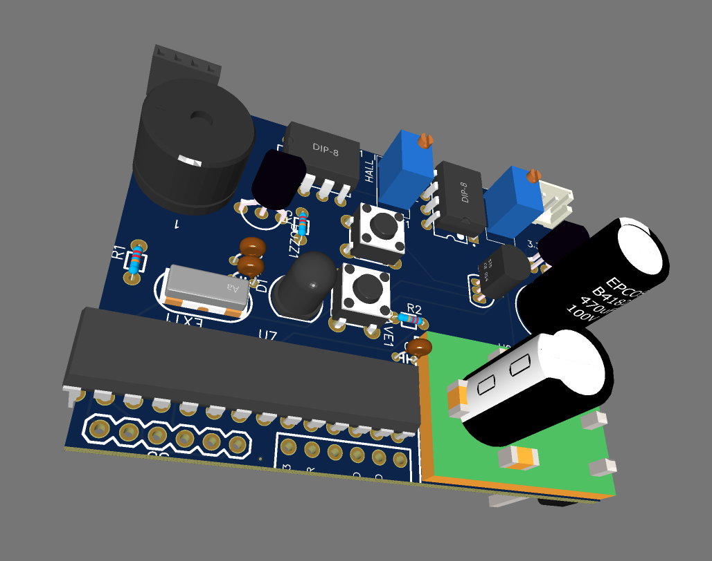
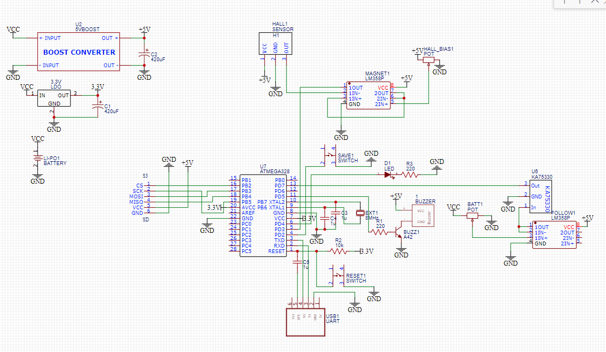

# Bike Logger

Atmega328P-based energy efficient sd card logger for a bike. 

Using a hall effect sensor together with a comparator and an interrupt, it measures how many times did the bike wheel complete a revolution in a given period of time. From this information we can calculate speed and distance.

## PCB

## Schematic

## License and copyright

© Dawid Pietrykowski

Licensed under the [MIT LICENSE](LICENSE)